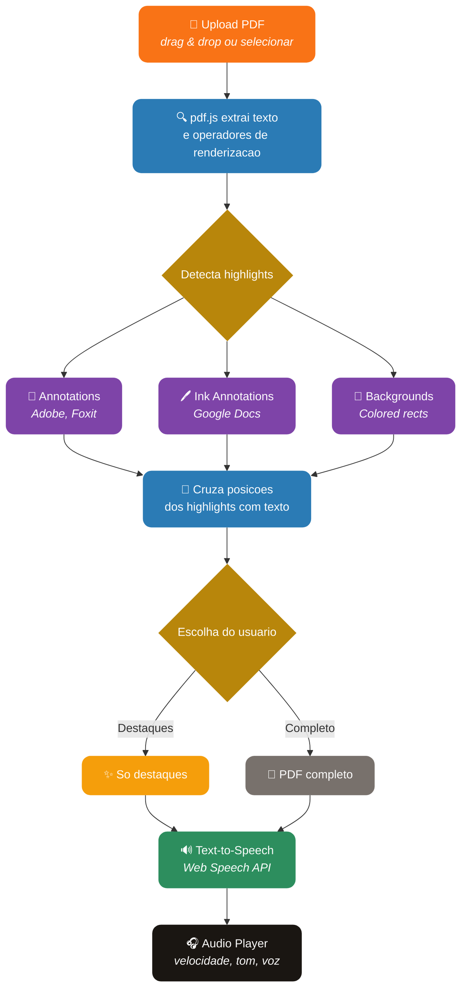

<div align="center">

# PDF Audiobook

**Transforme PDFs marcados em audiobooks — detecta highlights automaticamente e le em voz alta.**

[](https://typescriptlang.org)
[](https://react.dev)
[](https://vite.dev)
[](https://tailwindcss.com)
[](#license)

[Demo](https://johnpitter.github.io/pdf-audiobook/) · [Features](#-features) · [Como Funciona](#-como-funciona) · [Tech Stack](#-tech-stack) · [Desenvolvimento](#-desenvolvimento)

</div>

---

## O que e o PDF Audiobook?

PDF Audiobook e uma aplicacao web que le PDFs com trechos marcados (highlights) e os transforma em audio usando Text-to-Speech de alta qualidade. Faca upload de um PDF, o app detecta automaticamente os trechos destacados e voce pode ouvir apenas os destaques ou o documento completo.

**100% no navegador.** Nenhum dado e enviado para servidores. Os PDFs sao processados localmente via JavaScript.

---

## Features

| Categoria | O que voce ganha |
|---|---|
| **Upload de PDF** | Arraste ou selecione PDFs — deteccao automatica de highlights |
| **Deteccao de Highlights** | Suporta annotations de PDF (Adobe, Foxit), ink annotations (Google Docs), e backgrounds coloridos |
| **Modo Duplo** | Ouvir apenas os trechos marcados ou o PDF completo |
| **Player de Audio** | Controles de play/pause/stop/next/prev com barra de progresso clicavel |
| **Controle de Velocidade** | 0.5x a 2x com pills visuais |
| **Controle de Tom** | Ajuste de pitch (grave a agudo) para voz mais natural |
| **Selecao de Voz** | Vozes ranqueadas automaticamente por qualidade — prioriza neural/online pt-BR |
| **Waveform Visual** | Animacao de waveform durante reproducao |
| **Lista de Destaques** | Visualize todos os trechos marcados com indicacao de pagina |
| **Privacidade Total** | Zero servidores, zero cookies — processamento 100% local |
| **Design Premium** | Interface sofisticada com animacoes, micro-interacoes e visual Spotify-like |

---

## Como Funciona



### Deteccao Inteligente de Highlights

O extractor analisa o PDF em 3 camadas para encontrar texto marcado:

- **Annotations PDF**: Highlights, sublinhados e squiggly annotations criados por leitores como Adobe Reader, Foxit, Preview
- **Ink Annotations Google**: Marcacoes do Google Docs/Sheets exportados como PDF (`GOOG:INKIsInker`) com deteccao de cor e bounding box
- **Backgrounds Coloridos**: Retangulos com cores de highlight (amarelo, verde, rosa, azul) renderizados como fill no conteudo do PDF

### Ranking de Vozes

O TTS engine ranqueia automaticamente as vozes disponiveis no navegador:

1. Vozes pt-BR (prioridade maxima)
2. Vozes online/neural (qualidade superior)
3. Vozes Microsoft e Google (melhor naturalidade)
4. Vozes femininas (mais natural para leitura)
5. Descarta vozes low-quality (compact, espeak)

---

## Tech Stack

| Camada | Tecnologia |
|---|---|
| **Framework** | React 19 + TypeScript 6 |
| **Build** | Vite 8 |
| **Styling** | Tailwind CSS 4 |
| **PDF Parsing** | pdf.js (pdfjs-dist) — extrai texto + operadores |
| **Text-to-Speech** | Web Speech API (SpeechSynthesis) |
| **Icons** | Heroicons (SVG inline) |
| **Deploy** | GitHub Pages (GitHub Actions) |

---

## Desenvolvimento

### Pre-requisitos

- Node.js 20+
- npm

### Setup

```bash
# Clone
git clone https://github.com/JohnPitter/pdf-audiobook.git
cd pdf-audiobook

# Instale dependencias
npm install

# Dev server
npm run dev

# Build
npm run build
```

### Estrutura

```
src/
  App.tsx                          # App principal com 3 telas (upload, choose, player)
  index.css                        # Tailwind + animacoes customizadas
  components/
    FileUpload.tsx                 # Drag & drop upload com animacoes
    AudioPlayer.tsx                # Player de audio estilo Spotify
  lib/
    pdf-highlight-extractor.ts     # Extrai highlights via annotations + ink + backgrounds
    tts-engine.ts                  # TTS engine com ranking de vozes e controle de playback
```

---

## Privacidade

- Nenhum dado e enviado para servidores
- Nenhum cookie, nenhum rastreamento
- PDFs processados 100% no navegador (JavaScript)
- Text-to-Speech usando API nativa do navegador
- Ao fechar ou recarregar a pagina, todos os dados desaparecem
- Codigo fonte aberto para auditoria

---

## License

MIT License - use livremente.
